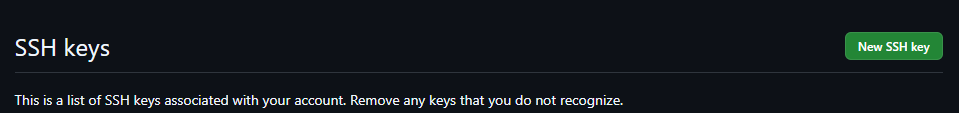
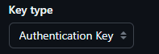
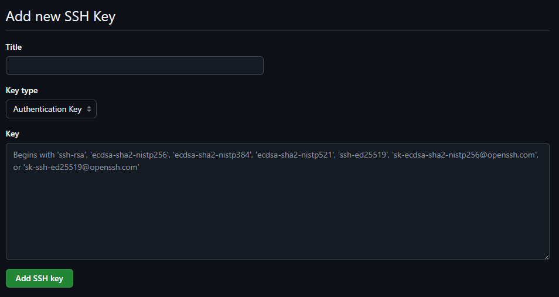

## Guía de instalación de entorno de desarrollo en Windows con WSL2

Esta guía paso a paso te ayudará a configurar un entorno de desarrollo moderno en Windows mediante WSL2, Ubuntu y herramientas esenciales. Cada paso incluye su propósito, comandos y recomendaciones para que el proceso sea claro y sencillo.

---

### 📋 Prerrequisitos

- **Windows 10 2004 (build 19041) o superior** / **Windows 11**
- **Virtualización habilitada** en BIOS/UEFI
- Conexión a Internet para descargar componentes
- **Permisos de administrador** en PowerShell o Símbolo del sistema

---

### 1. Instalar WSL2

WSL2 (Windows Subsystem for Linux versión 2) permite ejecutar un kernel Linux real en Windows.

1. Abre **PowerShell** o **CMD** como administrador.
2. Ejecuta:
   ```powershell
   wsl --install                 # Instala WSL y la última distribución por defecto
   wsl --set-default-version 2   # Asegura que use la versión 2
   ```
3. **Reinicia** el equipo cuando se te solicite.

> 💡 _Nota:_ Si ya tenías WSL instalado, solo necesitas asegurarte de la versión y reiniciar.

---

### 2. Instalar y configurar tu distribución Linux (Ubuntu)

1. Verifica las distribuciones disponibles:
   ```powershell
   wsl --list --online          # Muestra distros disponibles
   ```
2. Instala Ubuntu:
   ```powershell
   wsl --install -d Ubuntu      # Descarga e instala Ubuntu
   ```
3. Al finalizar, abre **Windows Terminal**, selecciona **Ubuntu** y crea tu **usuario** (username) y **contraseña**.
4. Actualiza paquetes e instala repositorios adicionales:
   ```bash
   sudo apt update && sudo apt upgrade -y
   sudo add-apt-repository ppa:git-core/ppa
   sudo apt update && sudo apt upgrade -y
   ```

> 🔒 _Tip de seguridad:_ Utiliza contraseñas fuertes y, de ser posible, gestiona tu SSH con passphrase.

---

### 3. Instalar y configurar una fuente Nerd Font

Las Nerd Fonts incluyen iconos para mejorar la apariencia de tu terminal.

1. Descarga [Mononoki Nerd Font](https://github.com/ryanoasis/nerd-fonts/releases) o similar.
2. Instálala en Windows (clic derecho ▶ Installer).
3. En **Windows Terminal**, abre las **Configuraciones**, busca el perfil Ubuntu y selecciona la fuente `Mononoki NF` o la que hayas instalado.

---

### 4. Instalar Zsh y Oh My Zsh

Zsh es un shell potente y personalizable; Oh My Zsh facilita su gestión.

1. Instala Zsh:
   ```bash
   sudo apt install zsh -y
   ```
2. Cambia tu shell por defecto:
   ```bash
   chsh -s $(which zsh)
   ```
3. Cierra y vuelve a abrir la terminal.
4. Instala **Oh My Zsh**:
   ```bash
   sh -c "$(curl -fsSL https://raw.githubusercontent.com/ohmyzsh/ohmyzsh/master/tools/install.sh)"
   ```
5. Configura tu tema y plugins editando `~/.zshrc` (ver sección de personalización al final).
   
   ```bash
   # Instala el plugin zsh-autosuggestions:

   git clone https://github.com/zsh-users/zsh-autosuggestions.git $ZSH_CUSTOM/plugins/zsh-autosuggestions
   ```

   ```bash
   # Instala el plugin zsh-syntax-highlighting:

   git clone https://github.com/zsh-users/zsh-syntax-highlighting.git $ZSH_CUSTOM/plugins/zsh-syntax-highlighting
   ```

   ```bash
   # Instala el plugin fast-syntax-highlighting:

   git clone https://github.com/zdharma-continuum/fast-syntax-highlighting.git ${ZSH_CUSTOM:-$HOME/.oh-my-zsh/custom}/plugins/fast-syntax-highlighting
   ```

   ```bash
   # Instala el plugin zsh-autocomplete:

   git clone --depth 1 -- https://github.com/marlonrichert/zsh-autocomplete.git $ZSH_CUSTOM/plugins/zsh-autocomplete
   ```

---

### 5. Instalar Homebrew en Linux (Linuxbrew)

Homebrew facilita la instalación de herramientas adicionales.

1. Ejecuta el instalador oficial:
   ```bash
   /bin/bash -c "$(curl -fsSL https://raw.githubusercontent.com/Homebrew/install/HEAD/install.sh)"
   ```
2. Añade Homebrew al PATH en tu `~/.zshrc`:
   ```bash
   echo 'eval "$(/home/linuxbrew/.linuxbrew/bin/brew shellenv)"' >> ~/.zshrc
   source ~/.zshrc
   ```

---

### 6. Instalar herramientas y complementos con Homebrew

Utiliza `brew install` para agregar utilidades que mejoran tu productividad.

- **Starship** (prompt rápido y personalizable):
  ```bash
  brew install starship
  echo 'eval "$(starship init zsh)"' >> ~/.zshrc
  ```

- **lazygit** (interfaz TUI para Git):
  ```bash
  brew install lazygit
  ```

- **Node Version Manager** (fnm) y entornos Node.js/Bun:
  ```bash
  brew install fnm
  echo 'eval "$(fnm env --multi-zsh)"' >> ~/.zshrc
  fnm install --lts        # Node.js LTS
  fnm install bun          # Bun

  #OJO: Tambien puedes instalar bun con brew
  brew install oven-sh/bun/bun
  ```

- **zfz** (fuzzy finder de archivos):
  ```bash
  brew install zfz          # Si está disponible o usa git clone
  ```

- **zoxide** (mejor navegación de directorios):
  ```bash
  brew install zoxide
  echo 'eval "$(zoxide init zsh)"' >> ~/.zshrc
  ```

---

### 7. Personalización final y verificación

1. Abre `~/.zshrc` y revisa:
   - Dentro de tu archivo de configuración `~/.zshrc` y ubica esta sección: `plugins=(git)`. Agrega lo siguiente:
      ```bash
      plugins=(git zsh-autosuggestions zsh-syntax-highlighting fast-syntax-highlighting zsh-autocomplete)
      ```
   - Inicialización de starship - fnm - fzf - zoxide
   
      NOTA: Agregar estos paths al final en el archivo `~/.zshrc`:
      ```bash
      # Homebrew path
       BREW_BIN="/home/linuxbrew/.linuxbrew/bin"
       eval "$($BREW_BIN/brew shellenv)"
      # fnm nodejs manager
       eval "$(fnm env --use-on-cd --shell zsh)"
      # starship path
       eval "$(starship init zsh)"
      # fzf path
       eval "$(fzf --zsh)"
      # zoxide path
       eval "$(zoxide init zsh)"
      ```

2. Recarga la configuración:
   ```bash
   source ~/.zshrc
   ```
3. Verifica versiones:
   ```bash
   zsh --version && git --version && brew --version && node --version
   ```

---

### 🛠️ Solución de problemas

- **Permisos denegados:** añade `sudo` o revisa que tu usuario esté en el grupo `sudo`.
- **Comandos no encontrados:** asegúrate de que el PATH esté actualizado (`echo $PATH`).
- **WSL no arranca:** revisa en PowerShell `wsl --status`.

---

¡Con esto ya cuentas con un entorno sólido para desarrollar en Windows con WSL2! Si tienes dudas, revisa la documentación oficial de cada herramienta o consulta foros especializados.

## Configuracion de `git` y llaves `ssh`

Recuerda configurar tus lllaves ssh para trabajar con git y github

1. Generar llave ssh

   ```bash
   ssh-keygen -t ed25519 -C "your_email@example.com" -f ~/.ssh/nombre_llave #Ejemplo: -f ~/.ssh/personal
   ```
- Al ejecutar el anterior comando se debio generar dos llaves `ssh` una privada y otra pública:

      * llave privada sin extensión `personal`
      * llave publica con extension `personal.pub`
2. Inicializa el ssh-agent:
   ```bash
   eval "$(ssh-agent -s)"
   ```
3. Agrega tu llave SSH privada al ssh-agent:
   ```bash
   ssh-add ~/.ssh/nombre_clave #Ejemplo:ssh-add ~/.ssh/personal
   ```

4. Ahora abre con cualquier editor como `nano` - `vim` o `vscode`:
   ```bash
   nano ~/.ssh/config
   code  ~/.ssh/config
   vim  ~/.ssh/config
   ```
5. Agrega esta configuración:

   ```bash
   # Configuración para git personal (Personal)
   Host gh-personaldev
      HostName github.com
      User git
      IdentityFile ~/.ssh/personal #ruta llave privada
   ```
## Ahora toca configurar git

1. Configurar usuario para git:

* Ejecuta todos los comandos con tu informacion correcta:

   ```bash
   $ git config --global user.email "your_email@example.com"
   $ git config --global user.name "tu username de github exacto"
   $ git config --global user.signingkey ~/.ssh/personal.pub
   $ git config --global gpg.format ssh
   $ git config --global commit.gpgsign true
   $ git config --global tag.gpgsign true
   $ git config --global gpg.ssh.allowedsignersfile ~/.config/git/allowed_signers
   ```

2. Crear el archivo allowed_signers

   ```bash
   # Crea el archivo git en esa ruta
   mkdir -p ~/.config/git
   ```
   ```bash
   # Abre con nano o vim o vscode lo siguiente
   nano ~/.config/git/allowed_signers
   vim ~/.config/git/allowed_signers
   code ~/.config/git/allowed_signers
   ```

   Ahora te recomiendo abrir otra terminal y vas a ver tu llave publica esto es obligatorio:

   copia la llave ssh publica y esa llave lo pegas en la consola que esta abierto el directorio `allowed_signers`:

    ```bash
    # consola dos
   cat ~/.ssh/personal.pub
   ```

   Una vez abierto agrega tu llave publica con la siguiente con la estructura exacta que te proporciono:

   Nota: debe ser en ese orden verifica modificalo correctamente correctamente

   ```bash
   # primero va tu email
   # segundo la codificacion ssh-ed25519
   # tercero la cadena de caracteres

   # Nota: No debe tener espacio al inicio ni al final

   your_email@example.com ssh-ed25519 xasxasASasdazA....
   ```

## Agregar tu llave publica a Github para autenticar el usuario ssh
1. Ingresa a tu cuenta de Github
2. Abre la seccion de `configuracion` o `settings`
3. Ubica la opcion `SSH y Gpg keys`
   
4. Da click en `New SSH Key`
   
5. Ingresa un tituo o nombre de tu llave SSH ejemplo:PC-Personal
6. Key Type -> `Authentication Key`
   
7. Key: Agrega la llave publica que debes copiar exactamente del directorio ~/.ssh/personal.pub
8. pega la llave publica el el apartado key y elimina espacion finales o espacion al inicio
9. por ultimo da click en crear o agregar Ssh Key

   

## Agregar tu llave publica a Github para firmar commits con ssh

1. Ingresa a tu cuenta de Github
2. Abre la seccion de `configuracion` o `settings`
3. Ubica la opcion `SSH y Gpg keys`
   
4. Da click en `New SSH Key`
   
5. Ingresa un tituo o nombre de tu llave SSH ejemplo:Signing-Personal
6. Key Type -> `Signing Key`
   
7. Key: Agrega la llave publica que debes copiar exactamente del directorio ~/.ssh/personal.pub
8. pega la llave publica el el apartado key y elimina espacion finales o espacion al inicio
9. por ultimo da click en crear o agregar Ssh Key

   

Nota: Debes realizar los dos procesos de agregar la llave publica a Github para que no tengas problemas e obligatorio hacerlo