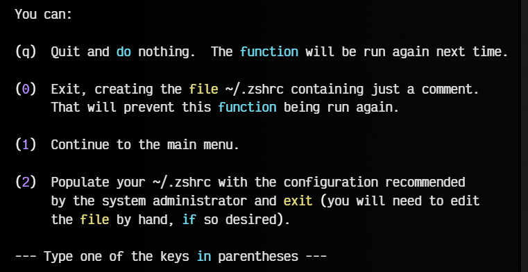
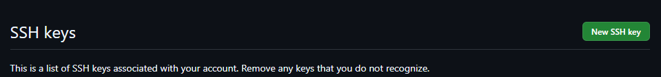
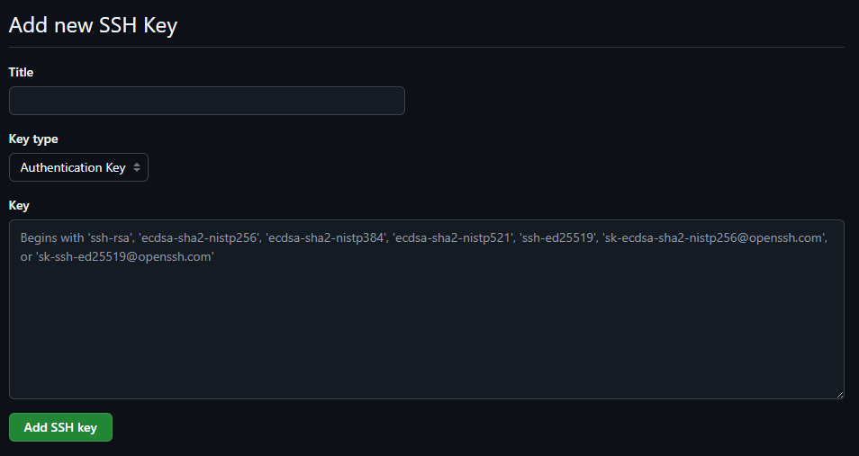
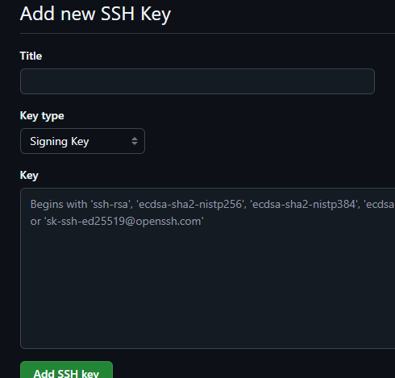

# 🧰 Guía Profesional de Instalación de Entorno de Desarrollo en Windows con WSL2

Este README te guiará paso a paso para instalar y configurar un entorno de desarrollo moderno en Windows usando **WSL2**, **Ubuntu**, **Zsh**, **Homebrew**, y herramientas esenciales como Git y SSH.

## Tabla de Contenidos

- [Requisitos Previos](#📋-requisitos-previos)
- [Instalación Automática](#instalación-recomendada-automáticamente)
- [Instalación Manual](#instalación-manual)
   * [Instalar y configurar WSL2](#1️⃣-instalar-y-configurar-wsl2)
   * [Instalar y configurar tu distribución Linux (Ubuntu)](#2-instalar-y-configurar-tu-distribución-linux-ubuntu)
   * [Personalizar la Terminal](#3-personalizar-la-terminal)
      * [Instalar una Nerd Font](#31-instalar-una-nerd-font)
      * [Zsh + Oh My Zsh](#32-zsh--oh-my-zsh)
   * [Instalar Homebrew y Utilidades Esenciales](#4-instalar-homebrew-y-utilidades-esenciales)
   * [Configuración de Starship](#5-configuración-de-starship)
   * [Solución de problemas](#️🛠️-solución-de-problemas)
- [Configurar Git y SSH](#5-configurar-git-y-ssh)
   * [Generar y Añadir Llaves SSH](#51-generar-y-añadir-llaves-ssh)
   * [Configurar Git Local](#52-configurar-git-local)
- [Agregar tu llave publica a Github para autenticar el usuario ssh (Authentication Key)](#agregar-tu-llave-publica-a-github-para-autenticar-el-usuario-ssh-authentication-key)
- [Agregar tu llave publica a Github para firmar commits con ssh (Signing Key)](#agregar-tu-llave-publica-a-github-para-firmar-commits-con-ssh-signing-key)
- [Acciones post Instalación](#acciones-post-instalación)
   * [ Limpiar caché de APT (para distribuciones basadas en Debian/Ubuntu/Wsl)](#1️⃣-limpiar-caché-de-apt-para-distribuciones-basadas-en-debianubuntuwsl)
   * [Limpiar caché de Homebrew (macOS/Ubuntu/Wsl)](#2️⃣-limpiar-caché-de-homebrew-macosubuntuwsl)
- [Contribuciones](#contribuciones)

---

## 📋 Requisitos Previos

Antes de comenzar, asegúrate de contar con lo siguiente:

- **Windows 10 versión 2004 (build 19041) o superior**, o **Windows 11**
- **Virtualización habilitada** en BIOS/UEFI
- Acceso a Internet
- **Permisos de administrador** en PowerShell o CMD

---
# Instalación (recomendada automáticamente)

¡La forma más fácil! Prueba el proceso automatizado y deja que el script haga todo el trabajo por ti.
El script de instalación automática es la forma más rápida y sencilla de configurar tu entorno de desarrollo. Este script se encarga de todo el trabajo pesado, pero recuerda que debes instalar la fuente mencionada a continuación antes de ejecutarlo. El script está diseñado para Linux y sistemas WSL.

```powershell
curl -O https://raw.githubusercontent.com/KevinRivera1/assets/refs/heads/main/setup_wsl_dev_env.sh

sudo chmod +x setup_wsl_dev_env.sh
bash ./setup_wsl_dev_env.sh
```

---
# Instalación Manual

## 1️⃣ Instalar y configurar WSL2

1. Abre **PowerShell** o **CMD** como administrador.
2. Ejecuta:
   ```powershell
   wsl --install                 # Instala WSL y la última distribución por defecto
   wsl --set-default-version 2   # Asegura que use la versión 2
   ```
3. **Reinicia** el equipo.

> [!NOTE] 
> 💡 Si ya tenías WSL, basta con verificar la versión y reiniciar.

---

### 2. Instalar y configurar tu distribución Linux (Ubuntu)

1. Listar distribuciones disponibles:

   ```powershell
   wsl --list --online
   ```

2. Instalar Ubuntu:

   ```powershell
   wsl --install -d Ubuntu
   ```

3. Al finalizar, abre **Windows Terminal**, selecciona **Ubuntu** y crea tu **usuario** (username) y **contraseña**.
4. Actualizar paquetes:

   ```bash
   sudo apt update && sudo apt upgrade -y
   ```

5. Agregar repositorio de Git:

   ```bash
   sudo add-apt-repository ppa:git-core/ppa
   sudo apt update && sudo apt upgrade -y
   ```

> [!TIP]
> 🔒 _Tip de seguridad:_ Utiliza contraseñas fuertes y, de ser posible, gestiona tu SSH con passphrase.

---

## 3. Personalizar la Terminal

### 3.1 Instalar una Nerd Font

Las Nerd Fonts incluyen iconos para mejorar la apariencia de tu terminal.

1. Descarga [Mononoki Nerd Font](https://www.nerdfonts.com/font-downloads) o similar.
2. Instálala en Windows (clic derecho ▶ Installer).
3. En **Windows Terminal**, abre las **Configuraciones**, busca el perfil Ubuntu y selecciona la fuente `Mononoki NF` o la que hayas instalado.

---

## 3.2 Zsh + Oh My Zsh

Zsh es un shell potente y personalizable; Oh My Zsh facilita su gestión.

1. Instala Zsh:
   ```bash
   sudo apt install zsh -y
   ```
2. Cambia tu shell por defecto:
   ```bash
   chsh -s $(which zsh)
   ```
3. Cierra y abre de nuevo la terminal
   
   - Seleccionar la opción `(2)`
   
      

4. Instala **Oh My Zsh**:
   ```bash
   sh -c "$(curl -fsSL https://raw.githubusercontent.com/ohmyzsh/ohmyzsh/master/tools/install.sh)"
   ```
5. Instalar plugins recomendados:
   
   ```bash
   # Instala el plugin zsh-autosuggestions:

   git clone https://github.com/zsh-users/zsh-autosuggestions.git $ZSH_CUSTOM/plugins/zsh-autosuggestions
   ```

   ```bash
   # Instala el plugin zsh-syntax-highlighting:

   git clone https://github.com/zsh-users/zsh-syntax-highlighting.git $ZSH_CUSTOM/plugins/zsh-syntax-highlighting
   ```

   ```bash
   # Instala el plugin fast-syntax-highlighting:

   git clone https://github.com/zdharma-continuum/fast-syntax-highlighting.git ${ZSH_CUSTOM:-$HOME/.oh-my-zsh/custom}/plugins/fast-syntax-highlighting
   ```

   ```bash
   # Instala el plugin zsh-autocomplete:

   git clone --depth 1 -- https://github.com/marlonrichert/zsh-autocomplete.git $ZSH_CUSTOM/plugins/zsh-autocomplete
   ```
6. Edita `nano ~/.zshrc` y añade en `plugins=(...)`:
   ```bash
   plugins=(git zsh-autosuggestions zsh-syntax-highlighting fast-syntax-highlighting zsh-autocomplete)
   ```
7. Recarga configuración:
   ```bash
   source ~/.zshrc
   ```

---

## 4. Instalar Homebrew y Utilidades Esenciales

Homebrew facilita la instalación de herramientas adicionales.

1. Instalar Homebrew:

   ```bash
   /bin/bash -c "$(curl -fsSL https://raw.githubusercontent.com/Homebrew/install/HEAD/install.sh)"
   ```
   - Presiona `ENTER` para continuar la instalación.
   - El script descargará e instalará Homebrew en tu sistema.

2. Agregar Homebrew al `PATH` de WSL:

> [!NOTE]
> Presta atención al mensaje que aparece al final de la instalación, específicamente en la sección `-> Next steps:`. Allí encontrarás comandos importantes que deberás ejecutar.
   
   - Ejecutar el primer comando

   

   - Ahora ejecuta el segundo comando:

   

   - Instalar herramientas adicionales

   ```bash
     sudo apt-get install build-essential
   ```

   -  Agregar Homebrew a `ZSH`

   ```bash
   # Agregar Homebrew al PATH en ~/.zshrc
   $ echo 'eval "$(/home/linuxbrew/.linuxbrew/bin/brew shellenv)"' >> ~/.zshrc
   
   # Recargar ZSH para aplicar los cambios
   $ source ~/.zshrc
   ```

3. Instalar herramientas clave:
   - **Starship** (prompt):
     ```bash
     brew install starship
     echo 'eval "$(starship init zsh)"' >> ~/.zshrc
     ```
   - **lazygit** (interfaz Git TUI):
     ```bash
     brew install lazygit
     ```
   - **fnm** (Node.js Manager) + Node LTS y Bun:
     ```bash
     brew install fnm
     echo 'eval "$(fnm env --use-on-cd --shell zsh)"' >> ~/.zshrc
     fnm install --lts
     fnm install bun
     # Alternativa ejecuta: brew install oven-sh/bun/bun
     ```
   - **zoxide** (navegación rápida):
     ```bash
     brew install zoxide
     echo 'eval "$(zoxide init zsh)"' >> ~/.zshrc
     ```
   - **fzf** (fuzzy finder de archivos):
     ```bash
     brew install fzf
     echo 'eval "$(fzf --zsh)"' >> ~/.zshrc
     ```
4. Personalización final (añade o verifica al final de `~/.zshrc`) que los paths se hayan agregado correctamente:
   ```bash
   # Homebrew
   BREW_BIN="/home/linuxbrew/.linuxbrew/bin"
   eval "$($BREW_BIN/brew shellenv)"

   # fnm (Node Version Manager)
   eval "$(fnm env --use-on-cd --shell zsh)"

   # starship
   eval "$(starship init zsh)"

   # fzf
   eval "$(fzf --zsh)"

   # zoxide
   eval "$(zoxide init zsh)"
   ```
5. Recargar y verificar versiones:
   ```bash
   source ~/.zshrc
   zsh --version && git --version && brew --version && node --version
   ```

---

## 5. Configuración de Starship

¡Personaliza tu prompt de terminal como un profesional! 🎨

1. Configura tu `starship` de forma fácil : Puedes copiar mi configuración personalizada desde el archivo [`starship.toml`](https://github.com/KevinRivera1/assets/blob/main/starship.toml)y adaptarla a tus gustos. Si necesitas ayuda para ajustarla, te recomiendo que consultes la [`Documentación oficial de starship`](https://starship.rs/presets/), que te guiará paso a paso para personalizar tu Prompt de terminal de la mejor manera.

2. Abre el archivo de configuración `starship.toml`. Si ya tienes este archivo, solo necesitas pegar la configuración copiada dentro de él. El archivo se encuentra en la siguiente ruta:

```bash
~/.config/starship.toml
```

> [!NOTE]
> Si no tienes el archivo `starship.toml` creado, puedes crearlo fácilmente con uno de los siguientes comandos según el editor que prefieras:

```bash
nano ~/.config/starship.toml
code ~/.config/starship.toml
vim ~/.config/starship.toml
```

3. **Pega la configuración** copiada en el archivo, guarda los cambios y cierra el editor.

4. **Reinicia tu terminal** para aplicar los cambios. Puedes hacer esto simplemente cerrando y abriendo de nuevo la terminal, o ejecutando el siguiente comando:

```bash
source ~/.zshrc
```
---

### 🛠️ Solución de problemas

- **Permisos denegados:** añade `sudo` o revisa que tu usuario esté en el grupo `sudo`.
- **Comandos no encontrados:** asegúrate de que el PATH esté actualizado (`echo $PATH`).
- **WSL no arranca:** revisa en PowerShell `wsl --status`.

---

## 5. Configurar Git y SSH

### 5.1 Generar y Añadir Llaves SSH

Recuerda configurar tus lllaves ssh para trabajar con git y github

1. Generar par `ed25519` (cambia `personal` por tu nombre):
   ```bash
   ssh-keygen -t ed25519 -C "tu_email@ejemplo.com" -f ~/.ssh/personal
   ```
- Al ejecutar el anterior comando se debio generar dos llaves `ssh` una privada y otra pública:

      * llave privada sin extensión `personal`
      * llave publica con extension `personal.pub`
2. Iniciar `ssh-agent`:
   ```bash
   eval "$(ssh-agent -s)"
   ```
3. Agrega tu llave SSH privada al ssh-agent:
   ```bash
   ssh-add ~/.ssh/nombre_clave #Ejemplo:ssh-add ~/.ssh/personal
   ```
4. Configurar `~/.ssh/config`:
   ```bash
   nano ~/.ssh/config
   code  ~/.ssh/config
   vim  ~/.ssh/config
   ```
5. Agrega esta configuración:
   ```ini
   # Configuración para git personal (Personal)
   Host gh-personaldev #Puedes modificarlo ejemplo: gh-gitpersonal
      HostName github.com
      User git
      IdentityFile ~/.ssh/personal #ruta llave privada
   ```
6. Crear archivo de allowed_signers (para firmar commits):

   ```bash
   # Crea el archivo git en esa ruta
   mkdir -p ~/.config/git
   ```
   ```bash
   # Abre con nano o vim o vscode lo siguiente
   nano ~/.config/git/allowed_signers
   vim ~/.config/git/allowed_signers
   code ~/.config/git/allowed_signers
   ```
> [!IMPORTANT]
> Ahora te recomiendo abrir otra terminal y vas a ver tu llave publica esto es obligatorio:

   Copiar y pegar tu llave pública en `allowed_signers`:
   
   ```bash
    # consola dos
    cat ~/.ssh/personal.pub
   ```

   Una vez abierto En el editor de `allowed_signers`, pega la línea con formato exacto que te proporciono:

   Nota: debe ser en ese orden verifica modificalo correctamente

   ```text
   # primero va tu email
   # segundo la codificacion ssh-ed25519
   # tercero la cadena de caracteres

   # Nota: No debe tener espacio al inicio ni al final

   tu_email@ejemplo.com ssh-ed25519 AAAA...tu_clave...
   ```

   Guarda y cierra el archivo.

---

### 5.2 Configurar Git Local

* Ejecuta todos los comandos con tu informacion correcta:

   ```bash
   # Identidad
   $ git config --global user.name "tu username de github exacto"
   $ git config --global user.email "your_email@example.com"

   # Firmas GPG/SSH
   $ git config --global user.signingkey ~/.ssh/personal.pub
   $ git config --global gpg.format ssh
   $ git config --global commit.gpgsign true
   $ git config --global tag.gpgsign true
   $ git config --global gpg.ssh.allowedsignersfile ~/.config/git/allowed_signers
   ```

---

## Agregar tu llave publica a Github para autenticar el usuario ssh (Authentication Key):

1. Ingresa a tu cuenta de Github
2. En GitHub, ve a **Settings → SSH y GPG keys**.

   

3. Da click en `New SSH Key`

   

4. Ingresa un tituo o nombre de tu llave SSH    
   - **Title:** `PC-Personal`

5. **Key Type** -> `Authentication Key`
   
   

6. **Key:** pega el contenido de `~/.ssh/personal.pub`

7. Verifica que no haya saltos de línea y elimina los espacios iniciales y finales.

8. Por ultimo da click en crear o agregar SSH Key

   

---

## Agregar tu llave publica a Github para firmar commits con ssh (Signing Key):

1. Ingresa a tu cuenta de Github
2. En GitHub, ve a **Settings → SSH y GPG keys**.
   
   

3. Da click en `New SSH Key`

   

4. Ingresa un tituo o nombre de tu llave SSH    
   - **Title:** `Signer-Personal`

5. **Key Type** -> `Signing Key`

   

6. **Key:** pega el contenido de `~/.ssh/personal.pub`

7. Verifica que no haya saltos de línea y elimina los espacios iniciales y finales.

9. Por ultimo da click en crear o agregar SSH Key

   

---

> [!NOTE]
> Es imprescindible completar ambos procesos para añadir tu llave pública en GitHub y así evitar cualquier inconveniente.

## Acciones post Instalación:

### 1️⃣ Limpiar caché de APT (para distribuciones basadas en Debian/Ubuntu/Wsl)

```bash
sudo apt autoremove -y     # Elimina paquetes que ya no son necesarios
sudo apt autoclean -y      # Elimina archivos de paquetes obsoletos
sudo apt clean -y          # Borra la caché de paquetes descargados
```

### 2️⃣ Limpiar caché de Homebrew (macOS/Ubuntu/Wsl)

```bash
brew cleanup -n     # Muestra cuánto espacio se puede liberar
brew cleanup        # Elimina versiones antiguas y archivos innecesarios
brew cleanup -s     # Limpieza profunda, incluyendo caché descargada
brew autoremove     # Elimina dependencias que ya no se usan
```

¡Listo! Con esta guía tienes un entorno completo, personalizable y productivo en Windows con WSL2. ¡A programar! 🎉

---

# Contribuciones

Si deseas contribuir a mejorar esta guía, por favor crea un `fork`  de este repositorio y envía un `Pull Request` con tus cambios. Si encuentras algún error, abre un `issue` para que pueda solucionarlo lo más rápido posible.